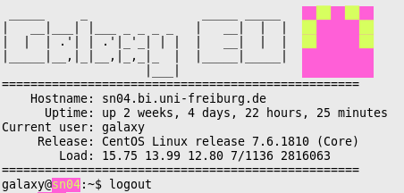

# ansible-dynmotd

A dynamic message-of-the-day login prompt. Includes an identicon generated from
the hostname, which should help prevent accidental reboots of incorrect
machines.



## Requirements


## Role Variables

Not all variables are listed or explained in detail. For additional information about less commonly used variables, see
the [defaults file][defaults].

[defaults]: defaults/main.yml

## Example Playbook

### Basic ###

Install Galaxy on your local system with all the default options:

```yaml
- hosts: localhost
  connection: local
  roles:
     - dynmotd
```

## License

GPLv3

## Author Information

This role was written and contributed to by the following people:

- [Helena Rasche](https://github.com/erasche)
